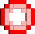
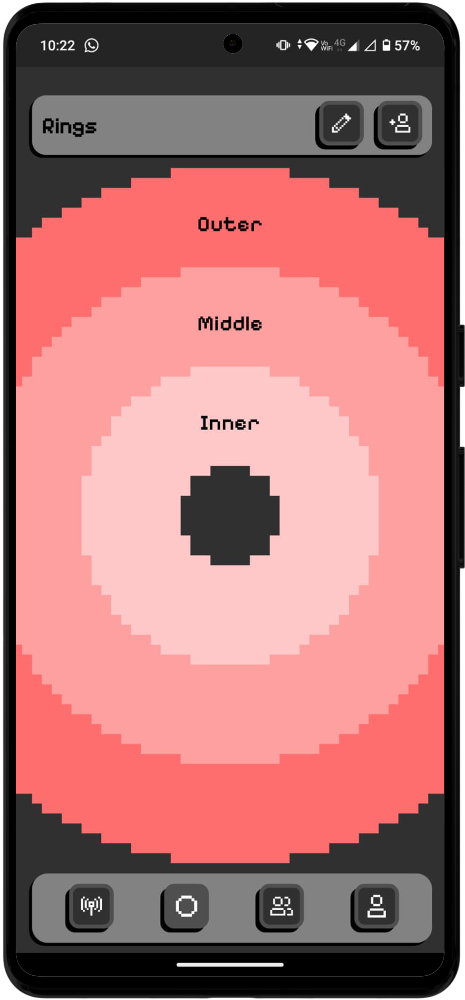
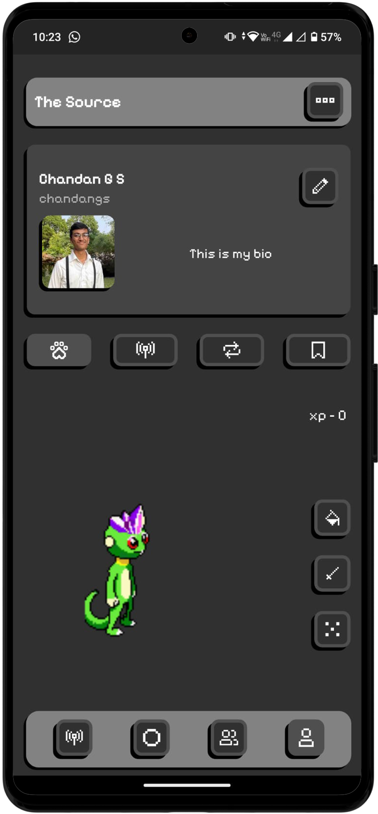
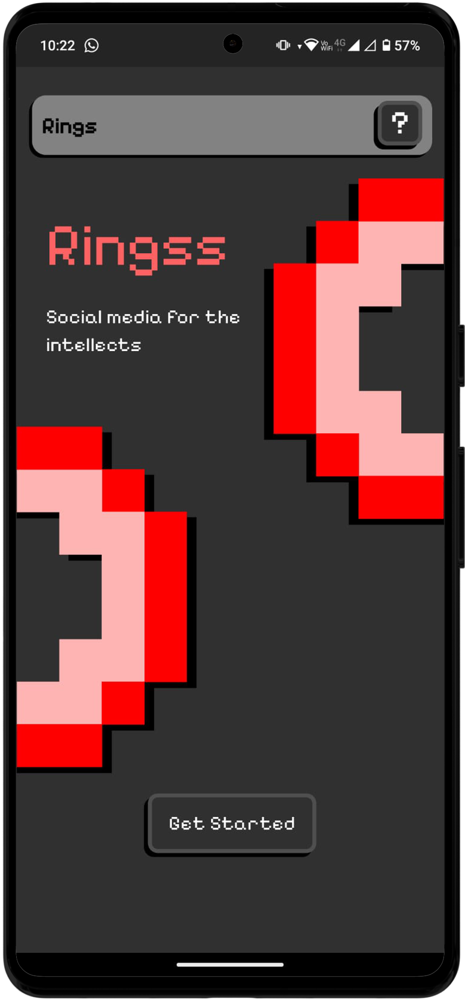

  
  <h1>Ringss: Rethinking Social Media with 3-Tier Privacy</h1>

Traditional social networks treat privacy as an afterthought—a cumbersome menu of toggles, lists, and settings. **Ringss fundamentally breaks this mold.** Ringss is a revolutionary, privacy-first social networking application. Instead of retrofitting privacy onto a public feed, Ringss is built from the ground up on a unique **3-Tier Social Architecture**. It implements tiered data access concepts, allowing users to inherently segment their content distribution across discrete "Rings"—**Private, Restricted, and Public**—all from a single, unified user state. 

With Ringss, you no longer need multiple accounts or complex "close friends" lists. You get complete control over your digital footprint without sacrificing the core social experience.

**Coming soon on playstore**

## ✨ The Ringss
* **Architected for Privacy:** Unlike platforms where public is the default, Ringss defaults to user control, letting you decide exactly which "Ring" your content belongs in.
  
* **The 3-Tier System:**
    *  **Private Ring:** A personal vault. Content intended only for you.
    *  **Restricted Ring:** Your inner circle. Shared exclusively with a highly curated, selected group of connections.
    *  **Public Ring:** Your megaphone. Visible to your wider network.
 
* **Single User State:** Manage these complex permission levels effortlessly from one unified interface, removing the friction of audience management.
  
* **High-Performance UI:** Built to feel instantaneous, utilizing GetX for hyper-fast reactive state management and dependency injection.
  
* **Bulletproof Backend:** Powered by a Supabase infrastructure handling complex, tiered row-level security and data access constraints behind the scenes.

## 🛠️ Technology Stack
* **Frontend:** Flutter (Dart)
* **State Management:** GetX
* **Backend:** Supabase

## 📸 Screenshots

  
  &nbsp;&nbsp;&nbsp;
  
  &nbsp;&nbsp;&nbsp;
  

